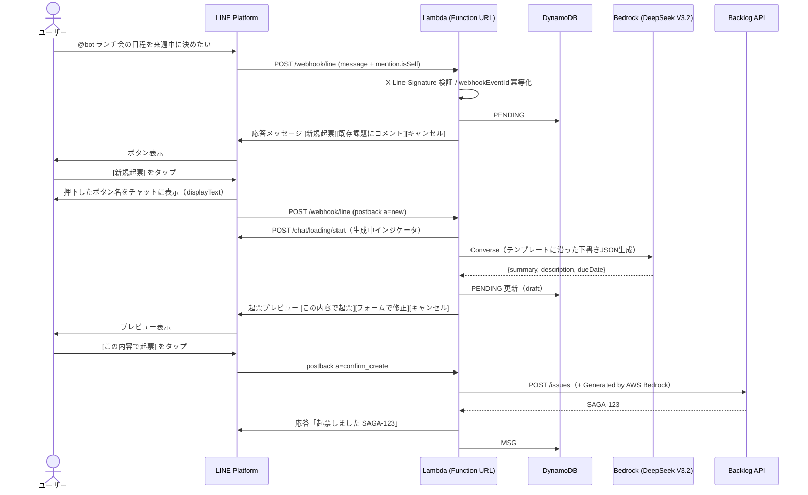
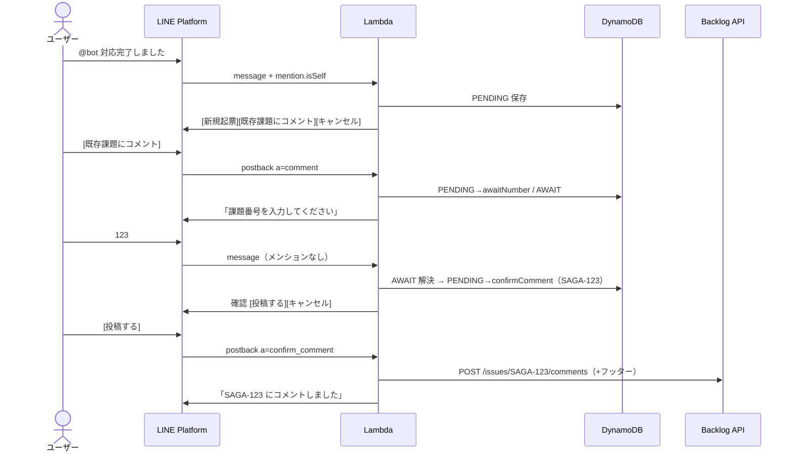
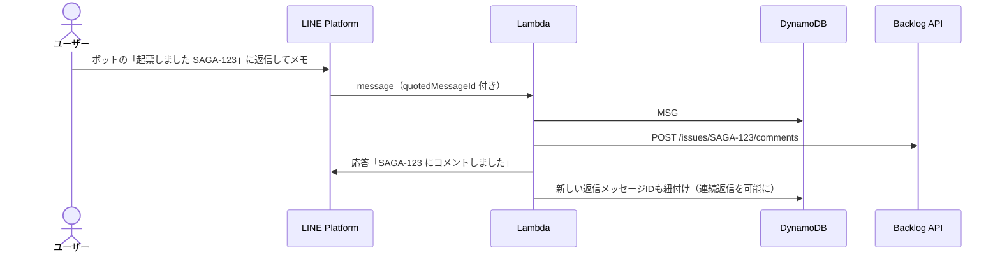
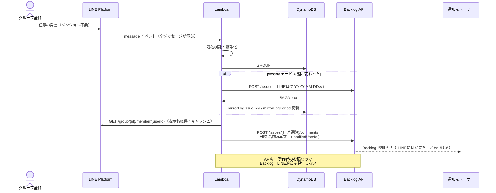
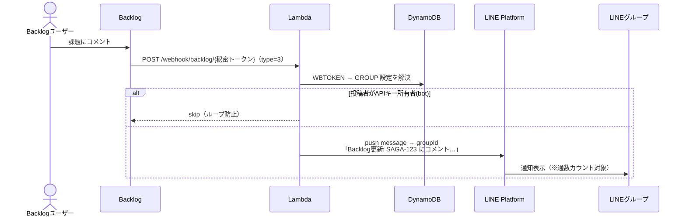
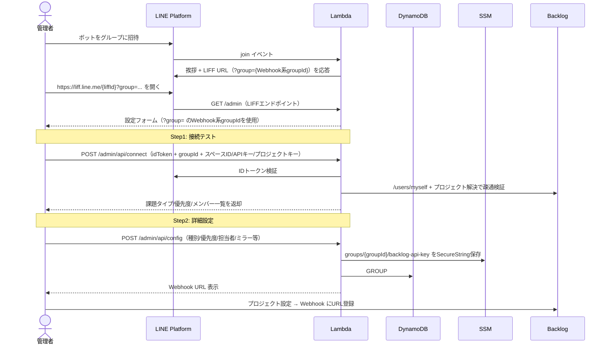

# 処理シーケンス図

## 1. 新規起票（メンション → 確認 → 起票）

```mermaid
sequenceDiagram
    actor U as ユーザー
    participant L as LINE Platform
    participant W as Lambda (Function URL)
    participant DB as DynamoDB
    participant G as Bedrock (DeepSeek V3.2)
    participant B as Backlog API

    U->>L: @bot ランチ会の日程を来週中に決めたい
    L->>W: POST /webhook/line (message + mention.isSelf)
    W->>W: X-Line-Signature 検証 / webhookEventId 冪等化
    W->>DB: PENDING#{id} 保存（intent, TTL 10分）
    W->>L: 応答メッセージ [新規起票][既存課題にコメント][キャンセル]
    L->>U: ボタン表示

    U->>L: [新規起票] をタップ
    L->>U: 押下したボタン名をチャットに表示（displayText）
    L->>W: POST /webhook/line (postback a=new)
    W->>L: POST /chat/loading/start（生成中インジケータ）
    W->>G: Converse（テンプレートに沿った下書きJSON生成）
    G-->>W: {summary, description, dueDate}
    W->>DB: PENDING 更新（draft）
    W->>L: 起票プレビュー [この内容で起票][フォームで修正][キャンセル]
    L->>U: プレビュー表示

    U->>L: [この内容で起票] をタップ
    L->>W: postback a=confirm_create
    W->>B: POST /issues（+ Generated by AWS Bedrock）
    B-->>W: SAGA-123
    W->>L: 応答「起票しました SAGA-123」
    W->>DB: MSG#{返信メッセージID} → SAGA-123 を紐付け
```

## 2. 既存課題へのコメント（番号入力）

```mermaid
sequenceDiagram
    actor U as ユーザー
    participant L as LINE Platform
    participant W as Lambda
    participant DB as DynamoDB
    participant B as Backlog API

    U->>L: @bot 対応完了しました
    L->>W: message + mention.isSelf
    W->>DB: PENDING 保存
    W->>L: [新規起票][既存課題にコメント][キャンセル]
    U->>L: [既存課題にコメント]
    L->>W: postback a=comment
    W->>DB: PENDING→awaitNumber / AWAIT#{group}#{user} 保存
    W->>L: 「課題番号を入力してください」

    U->>L: 123
    L->>W: message（メンションなし）
    W->>DB: AWAIT 解決 → PENDING→confirmComment（SAGA-123）
    W->>L: 確認 [投稿する][キャンセル]
    U->>L: [投稿する]
    L->>W: postback a=confirm_comment
    W->>B: POST /issues/SAGA-123/comments（+フッター）
    W->>L: 「SAGA-123 にコメントしました」
```

## 3. 返信によるコメント追記

```mermaid
sequenceDiagram
    actor U as ユーザー
    participant L as LINE Platform
    participant W as Lambda
    participant DB as DynamoDB
    participant B as Backlog API

    U->>L: ボットの「起票しました SAGA-123」に返信してメモ
    L->>W: message（quotedMessageId 付き）
    W->>DB: MSG#{quotedMessageId} → SAGA-123 を解決
    W->>B: POST /issues/SAGA-123/comments
    W->>L: 応答「SAGA-123 にコメントしました」
    W->>DB: 新しい返信メッセージIDも紐付け（連続返信を可能に）
```

## 4. 全発言ミラー（週次ログ課題）

```mermaid
sequenceDiagram
    actor U as グループ全員
    participant L as LINE Platform
    participant W as Lambda
    participant DB as DynamoDB
    participant B as Backlog API
    participant N as 通知先ユーザー

    U->>L: 任意の発言（メンション不要）
    L->>W: message イベント（全メッセージが飛ぶ）
    W->>W: 署名検証・冪等化
    W->>DB: GROUP#{groupId} から mirrorMode 確認
    alt weekly モード & 週が変わった
        W->>B: POST /issues 「LINEログ YYYY-MM-DD週」
        B-->>W: SAGA-xxx
        W->>DB: mirrorLogIssueKey / mirrorLogPeriod 更新
    end
    W->>L: GET /group/{id}/member/{userId}（表示名取得・キャッシュ）
    W->>B: POST /issues/{ログ課題}/comments<br/>「日時 名前\n本文」+ notifiedUserId[]
    B-->>N: Backlog お知らせ（「LINEに何か来た」と気づける）
    Note over W,B: APIキー所有者の投稿なので<br/>Backlog→LINE通知は発生しない
```

## 5. Backlog → LINE 通知

```mermaid
sequenceDiagram
    actor M as Backlogユーザー
    participant B as Backlog
    participant W as Lambda
    participant DB as DynamoDB
    participant L as LINE Platform
    participant G as LINEグループ

    M->>B: 課題にコメント
    B->>W: POST /webhook/backlog/{秘密トークン}（type=3）
    W->>DB: WBTOKEN → GROUP 設定を解決
    alt 投稿者がAPIキー所有者(bot)
        W-->>B: skip（ループ防止）
    else
        W->>L: push message → groupId<br/>「Backlog更新: SAGA-123 にコメント…」
        L->>G: 通知表示（※通数カウント対象）
    end
```

## 6. 初期設定（join → LIFF → Backlog Webhook登録）

```mermaid
sequenceDiagram
    actor A as 管理者
    participant L as LINE Platform
    participant W as Lambda
    participant DB as DynamoDB
    participant S as SSM
    participant B as Backlog

    A->>L: ボットをグループに招待
    L->>W: join イベント
    W->>L: 挨拶 + LIFF URL（?group={Webhook系groupId}）を応答
    A->>L: https://liff.line.me/{liffId}?group=... を開く
    L->>W: GET /admin（LIFFエンドポイント）
    W-->>A: 設定フォーム（?group= のWebhook系groupIdを使用）
    Note over A,W: Step1: 接続テスト
    A->>W: POST /admin/api/connect（idToken + groupId + スペースID/APIキー/プロジェクトキー）
    W->>L: IDトークン検証
    W->>B: /users/myself + プロジェクト解決で疎通検証
    W-->>A: 課題タイプ/優先度/メンバー一覧を返却
    Note over A,W: Step2: 詳細設定
    A->>W: POST /admin/api/config（種別/優先度/担当者/ミラー等）
    W->>S: groups/{groupId}/backlog-api-key をSecureString保存
    W->>DB: GROUP# + WBTOKEN# 保存（webhookToken払出）
    W-->>A: Webhook URL 表示
    A->>B: プロジェクト設定 → Webhook にURL登録
```
